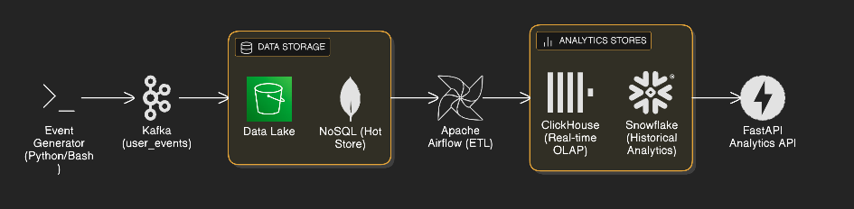

# RUBAP: Real-Time User Behavior Analytics Platform
<br>



## Overview

This project implements an end-to-end real-time analytics data platform designed to ingest, process, store, and serve large-scale user activity data in both streaming and batch modes. The system simulates a modern product analytics use case, where high-volume event data generated by user interactions must be reliably collected, transformed into meaningful metrics, and exposed to downstream consumers with low latency and strong consistency guarantees.

## Architecture

The platform follows an **event-driven architecture**, in which user interaction events are continuously produced and ingested through a distributed streaming layer. The system is designed with production-oriented engineering principles, including:

- Containerized deployment
- Clear separation of concerns
- Configuration-driven services
- Idempotent data pipelines
- Reproducible environments

## Key Components

### 1. Data Ingestion Layer
- **Distributed Streaming Layer**: Continuously ingests high-volume user interaction events
- **Event Validation**: Validates incoming events before processing
- **Dual Storage Strategy**: Persists data in both hot and cold storage layers

### 2. Storage Layer

#### Hot Storage (NoSQL)
- Low-latency NoSQL store for recent state
- Optimized for operational access patterns
- Provides fast access to current user activity data

#### Cold Storage (Data Lake) — MinIO
- **MinIO** (`minio/minio:latest`) serves as the S3-compatible data lake
- Immutable source of truth for raw event data
- Time-based (Hive-style) partitioning for efficient querying: `year=YYYY/month=MM/day=DD/`
- JSON batch files written by the `kafka_to_minio.py` consumer
- Supports long-term data retention and is queryable by tools such as Spark, Trino, or DuckDB

### 3. Processing Layer

#### Workflow Orchestration
- Coordinates batch and micro-batch processing tasks
- Manages data transformation pipelines

#### Data Transformations
- Data cleaning and validation
- Deduplication
- Time-based aggregation
- Metric computation
- Creates curated analytical datasets

### 4. Analytical Storage

#### Real-Time Analytical Database
- Column-oriented database optimized for low-latency queries
- Supports real-time analytical workloads
- Enables fast querying of recent and processed data

#### Cloud Data Warehouse
- Optimized for historical analysis
- Supports reporting and business intelligence workloads
- Handles large-scale historical data queries

### 5. Data Serving Layer

#### RESTful API
- Exposes business-level metrics and user activity summaries
- Serves downstream applications, dashboards, and analytical tools
- Provides access to both real-time and historical insights

#### Typical Outputs
- Time-windowed activity metrics
- Usage trends
- Per-user behavioral summaries

### 6. Data Lake Consumer (`kafka_to_minio.py`)

Bridges Kafka and the MinIO data lake by consuming the `user-events` topic and persisting batched events as JSON files.

#### How It Works

- Connects to Kafka as consumer group `minio-lake-consumer`
- Buffers incoming messages and flushes to MinIO when either **100 messages** accumulate or **30 seconds** elapse — whichever comes first
- Each flush creates one JSON file containing an array of events
- Files are stored with Hive-style partitioning for downstream compatibility:

```
user-events-lake/
└── user-events/
    └── year=2025/
        └── month=01/
            └── day=15/
                ├── 103045-p0-o0.json
                ├── 103115-p1-o100.json
                └── ...
```

#### Usage

```bash
# Install dependencies
pip install -r requirements.txt

# Run with defaults (Kafka at localhost:9092, MinIO at localhost:9000)
python kafka_to_minio.py

# Run with custom configuration via environment variables
KAFKA_BOOTSTRAP=localhost:9092 \
MINIO_ENDPOINT=localhost:9000 \
MINIO_ACCESS_KEY=minioadmin \
MINIO_SECRET_KEY=minioadmin \
BATCH_SIZE=200 \
FLUSH_INTERVAL_SECONDS=60 \
python kafka_to_minio.py
```

#### Configuration

| Environment Variable    | Default               | Description                              |
|-------------------------|-----------------------|------------------------------------------|
| `KAFKA_BOOTSTRAP`       | `localhost:9092`      | Kafka bootstrap server                   |
| `KAFKA_TOPIC`           | `user-events`         | Topic to consume                         |
| `KAFKA_GROUP_ID`        | `minio-lake-consumer` | Consumer group ID                        |
| `MINIO_ENDPOINT`        | `localhost:9000`      | MinIO host:port                          |
| `MINIO_ACCESS_KEY`      | `minioadmin`          | MinIO access key                         |
| `MINIO_SECRET_KEY`      | `minioadmin`          | MinIO secret key                         |
| `MINIO_BUCKET`          | `user-events-lake`    | Destination bucket                       |
| `BATCH_SIZE`            | `100`                 | Messages per batch file                  |
| `FLUSH_INTERVAL_SECONDS`| `30`                  | Max seconds between flushes              |

> **Alternative — Kafka Connect + S3 Sink Connector:** The custom consumer was chosen to keep full control over the pipeline without introducing additional infrastructure. It can be replaced by **Kafka Connect** with the **S3 Sink Connector**, which provides the same functionality (Kafka topic → MinIO bucket) as a configuration-driven managed service. The trade-off is an additional JVM container and connector lifecycle management via REST API.

### 7. Event Generator

#### Real-Time Data Generator (`data_generator.py`)
- **Purpose**: Generates realistic user behavior events in real-time streaming mode
- **Design**: Each script instance represents a single user. Run multiple instances to simulate multiple users
- **Output Format**: JSON Lines (JSONL), one event per line
- **Event Types**: Supports multiple event types including:
  - Page views, clicks, product views
  - Search queries, filters
  - Cart operations (add to cart)
  - Purchases, reviews, shares
- **Burst Pattern**: Simulates realistic activity bursts - after 2 normal intervals, generates 5 events immediately
- **Kafka-Ready**: Outputs to stdout or file, designed to be piped to Kafka producers
- **Configurable**: Adjustable user ID, event interval, and duration

#### Usage Examples

```bash
# Generate events for user_001, 2 second intervals, output to stdout
python data_generator.py --user-id user_001 --interval 2

# Generate events for 60 seconds, save to file
python data_generator.py --user-id user_002 --interval 2 --duration 60 --output events.jsonl

# Generate events with 1 second intervals (auto-generated user ID)
python data_generator.py --interval 1

# Simulate multiple users (run in separate terminals)
python data_generator.py --user-id user_001 --interval 2 &
python data_generator.py --user-id user_002 --interval 2 &
python data_generator.py --user-id user_003 --interval 2 &

# Pipe directly to Kafka (when Kafka is set up)
python data_generator.py --user-id user_001 --interval 2 | kafka-console-producer --topic user-events --bootstrap-server localhost:9092
```

#### Event Schema

Each event follows this structure:
```json
{
  "event_id": "evt_<timestamp>_<random>",
  "event_type": "<event_type>",
  "timestamp": "<ISO 8601 timestamp>",
  "user_id": "<user_id>",
  "properties": {
    // Event-specific properties vary by event_type
  }
}
```

## Data Flow

1. **Event Generation**: User interaction events are continuously produced
2. **Ingestion**: Events are ingested through the distributed streaming layer
3. **Validation & Persistence**: Events are validated and stored in both hot (NoSQL) and cold (Data Lake) storage
4. **Processing**: Batch and micro-batch workflows transform raw events into curated datasets
5. **Analytical Storage**: Processed data is loaded into real-time analytical database and cloud data warehouse
6. **Serving**: RESTful API exposes metrics and insights to downstream consumers

## Features

- **Dual-Mode Processing**: Supports both streaming and batch processing modes
- **Scalability**: Designed to handle large-scale user activity data
- **Low Latency**: Optimized for real-time insights and operational queries
- **Strong Consistency**: Ensures reliable data processing and storage
- **Time-Based Partitioning**: Efficient data organization for querying and retention
- **Idempotent Pipelines**: Ensures data reliability and reproducibility
- **Production-Ready**: Containerized, configurable, and reproducible

## Use Cases

This platform enables:

- Real-time monitoring of user behavior and activity
- Historical analysis of user interactions and trends
- Business intelligence and reporting
- Dashboard and application integration
- Metric computation and aggregation
- Long-term data retention and analysis

## Note

Although the data used in the system is synthetically generated, the architecture, data flow, and operational patterns closely mirror those used in real-world data platforms at scale. This project demonstrates how raw, high-volume event data can be transformed into reliable, queryable business insights through a scalable and well-structured data engineering pipeline.
